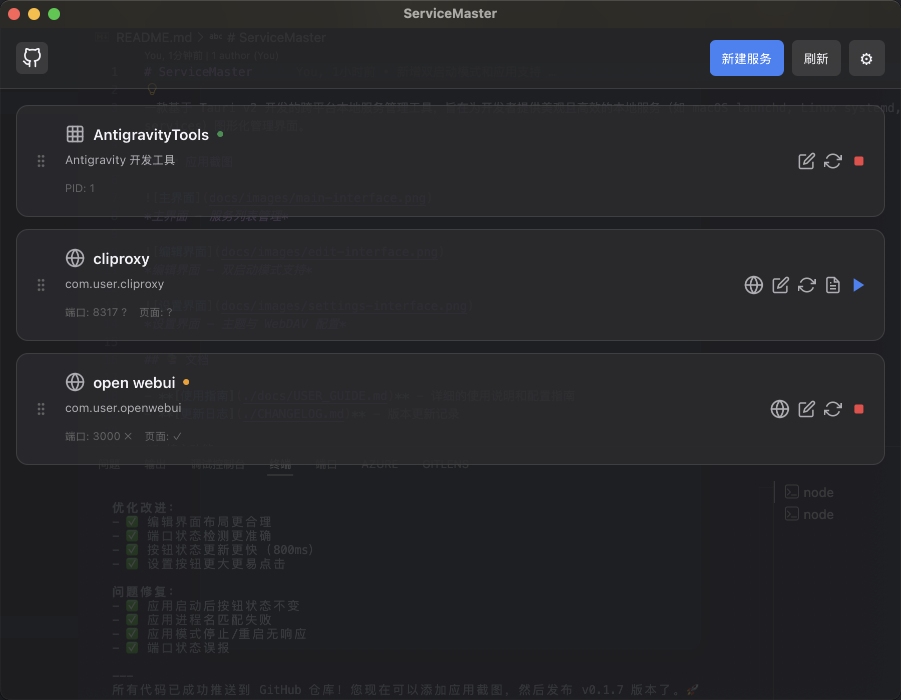
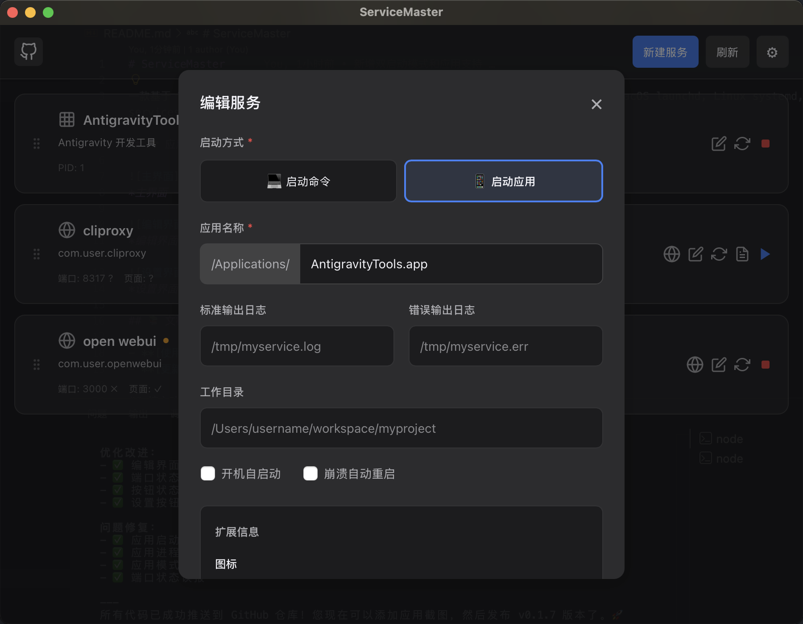
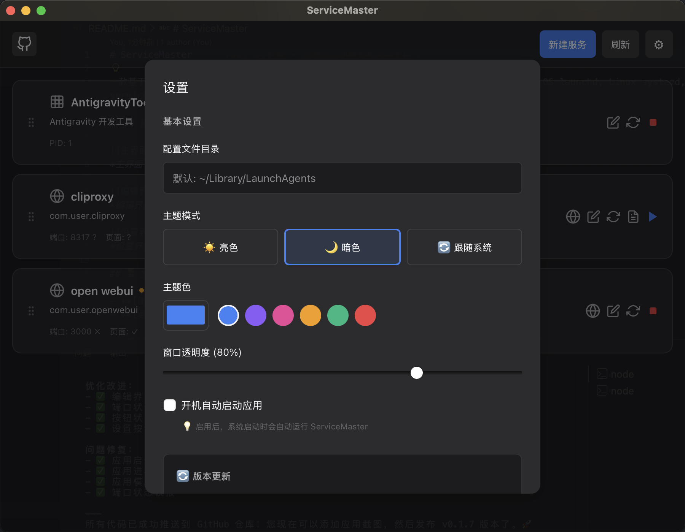

# ServiceMaster

一款基于 Tauri v2 开发的跨平台本地服务管理工具，旨在为开发者提供美观且高效的本地服务（如 macOS launchd, Linux systemd, Windows services）图形化管理界面。

## 📸 应用截图


*主界面 - 服务列表管理*


*编辑界面 - 双启动模式支持*


*设置界面 - 主题与 WebDAV 配置*

## 📚 文档

- **[使用指南](./docs/USER_GUIDE.md)** - 详细的使用说明和配置指南
- **[更新日志](./CHANGELOG.md)** - 版本更新记录

## 核心功能

- **🚀 服务管理**：可视化管理本地开发服务，支持启动、停止、重启及状态检测。
- **💻 双启动模式**：
  - **启动命令模式**：管理 CLI 工具和服务（如 OpenWebUI、MySQL、Redis）
  - **启动应用模式**：直接管理 macOS 应用（如 AntigravityTools、Google Chrome）
  - 智能图标切换：选择模式时自动切换对应的图标
  - 运行状态检测：应用模式与服务模式一致，实时显示启动/停止状态
- **🌐 跨平台支持**：支持 macOS (launchd)、Windows (计划任务/服务预留) 及 Linux (systemd)。
- **☁️ WebDAV 同步**：支持将服务配置、图标、元数据同步至 WebDAV（如坚果云），方便多机同步。
- **📦 预设模板**：内置常用服务模板（CLIProxy、OpenWebUI、AntigravityTools 等），支持快速创建。
- **📊 实时日志**：集成服务日志查看器，支持实时滚动及清空日志。
- **🔍 健康检查**：自动检测服务端口占用及 HTTP 健康状态，延迟检查避免误报。
- **🎨 高度自定义**：支持主题色、窗口透明度及亮/暗色模式切换。
- **💡 智能提示**：操作成功/失败使用美观的 Toast 提示，不再阻塞界面。

## 快速开始

### 安装

从 [GitHub Releases](https://github.com/ahao430/mac-service-master/releases) 下载最新版本。

### macOS 安装说明

由于本项目目前未经过 Apple 开发者付费签名，安装后打开可能会提示 **"文件已损坏"** 或 **"无法验证开发者"**。这并不是文件真的损坏，请尝试以下解决方法：

1. **终端命令（推荐）**：
   打开终端，输入以下命令并回车（可能需要输入开机密码）：
   ```bash
   sudo xattr -rd com.apple.quarantine /Applications/ServiceMaster.app
   ```
2. **系统设置**：
   前往 `系统设置` -> `隐私与安全性` -> `安全性`，点击 **"仍要打开"**。
3. **右键打开**：
   在应用程序文件夹中，按住 `Control` 键点击应用图标，选择 `打开`，在弹窗中再次点击 `打开`。

详细使用说明请查看 **[使用指南](./docs/USER_GUIDE.md)**。

## 技术栈

- **Frontend**: React + TypeScript + Vite + dnd-kit (拖拽排序)
- **Backend**: Rust + Tauri v2
- **Plugins**: Updater, Dialog, FileSystem, Opener

## 开发与构建

### 准备工作

确保已安装 [Rust](https://www.rust-lang.org/) 和 [Node.js](https://nodejs.org/)。

### 安装依赖

```bash
npm install
```

### 调试运行

```bash
npm run tauri dev
```

### 构建打包

```bash
npm run tauri build
```

## 备份与同步说明

本应用支持 WebDAV 同步。对于**坚果云**用户：
1. 服务器地址建议使用：`https://dav.jianguoyun.com/dav/service-master/`
2. 应用会自动尝试创建 `service-master` 目录。
3. 如果同步失败，请确保已在坚果云后台开启 WebDAV 服务并创建了对应的应用密码。

## 开源协议

MIT
